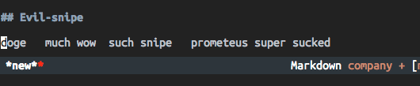
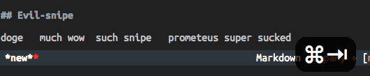

# evil-snipe

> This is a new (and potentially buggy) plugin and I am an elisp newb -- any
> advice or contributions would be appreciated!

Evil-snipe marries [vim-sneak](https://github.com/justinmk/vim-sneak) and
[vim-seek](https://github.com/goldfeld/vim-seek) with Emacs, for evil. How evil.

It offers two-character searches with `s` and `S` keys (forward and back,
respectively), and `z`/`Z` in operator mode.

Evil-snipe can be configured to accept N-characters (to possibly replace
evil-search or acejump). Or if you prefer, it can replace evil's native f/F/t/T
functionality.

Truly evil.

## Installation

Evil-snipe is on MELPA, install it with `M-x package-install RET evil-snipe`

And enable it with:

```elisp
(require 'evil-snipe)
(global-evil-snipe-mode 1)
```

## Preview




## Features

  * `s/S`
    * `|the abacus is` => `sab`  => `the |abacus is`
    * `the abacus| is` => `Sab`  => `the |abacus is`
  * `z/Z` = inclusive, `x/X` = exclusive
    * `|the abacus is` => `dzab` => `|acus is`
    * `the abacus| is` => `dZab` => `the | is`
    * `|the abacus is` => `dxab` => `|abacus is`
    * `the abacus| is` => `dXab` => `the ab| is`
  * Snipe is always literal: `s\*` jumps to a literal `\*`
  * `s<Enter>` repeats, `S<Enter>` repeats in the opposite direction. `;` and
    `,` are aliases.
  * Set `evil-snipe-override-evil` to non-nil to
  * [Clever-f](https://github.com/rhysd/clever-f.vim) functionality
    (`evil-snipe-repeat-keys`): repeat searchs with `s` and `S` (reverse). Also
    applies to `f/F/t/T` if you used `evil-snipe-override-evil`.
  * Backspace to undo characters
  * `TAB` in the prompt increments N on the fly, and lets you type more
    characters. e.g. `s<tab><tab>goal`
  * Highlight matches if `evil-snipe-enable-highlight`
  * Incrementally highlight (as you type) if
    `evil-snipe-enable-incremental-highlight`
  * Change scope of searches with `evil-snipe-scope`
  * Change scope of searches while repeating with `evil-snipe-repeat-scope`
    (separate from `evil-snipe-scope`)
  * Change what the count prefix means to snipe with `evil-snipe-count-scope`
    * if nil, treat COUNT as default in vim: times-to-repeat
    * if 'letters, accept COUNT characters
    * if 'vertical, scope is column bound (vertical scoping) (not implemented)
  * Supports **smart case**. If `evil-snipe-smart-case` is non-nil, searches
    will be case-insensitive unless they include capital letters.
  * Regex symbol groups. See `evil-snipe-symbol-groups`. You can map single
    characters to entire regex expressions. For instance, `]` => `[])}]`
  * Set `evil-snipe-auto-scroll` to non-nil to have window scroll with your
    searches (keeps your selection on the same line).

### Planned

  * Vertical-scoping: `5shi` will jump to the next occurance of 'hi' that is
    within 5 columns of the cursor on any following line.
  * `r/R` operators for targeting remote objects (e.g. `driwhi` = delete remote inner word
    'hi'), then return to starting point
  * `p/P` operators that do what `r/R` does, but stays in the modified location.
  * `r/R/p/P` text-objects, so: `dirwo` will delete the next inner word containing `wo`.
    dorwo will target the next OUTER word.
  * Repeating with `n/N`?

## Configuration

* If you want sniping in visual mode:

  ```elisp
  (evil-define-key 'visual evil-snipe-mode-map "z" 'evil-snipe-f)
  (evil-define-key 'visual evil-snipe-mode-map "Z" 'evil-snipe-F)
  ```

* Snipe disables evil-mode's substitute commands (s/S). To prevent this,
  set `evil-snipe-auto-disable-substitute` to nil (before evil-snipe is loaded).

* To change the highlight colors, configure: `evil-snipe-first-match-face` and
  `evil-snipe-matches-face`

### Variables

Use `M-x describe-variable` to get more information.

  * `evil-snipe-override-evil (nil)`: Replace evil-mode's f/F/t/T/;/, with
    snipe.
  * `evil-snipe-repeat-keys (t)`: enable repeating searches with s/S (applies to
    f/F/t/T if `evil-snipe-override-evil` is t).
  * `evil-snipe-enable-highlight (t)`: highlight search matches.
  * `evil-snipe-enable-incremental-highlight (t)`: highlight search matches as
    you type.
  * `evil-snipe-scope ('visible)`: control scope of searches.
  * `evil-snipe-repeat-scope ('whole-visible')`: control scope of repeated
    searches (accepts same as `evil-snipe-scope`).
  * `evil-snipe-show-prompt (t)`: show `N>` prompt in minibuffer while sniping, if non-nil.
  * `evil-snipe-smart-case (nil)`: if non-nil, searches are case sensitive only
    when capitals are used.
  * `evil-snipe-auto-scroll (nil)`: if non-nil, window will follow your cursor as you snipe.
  * `evil-snipe-symbol-groups ('())`: a list of `'(CHAR REGEX)`'s that map
    specific characters to regex patterns.

### Configure like vim-seek

```elisp
(setq evil-snipe-scope 'line)
(setq evil-snipe-repeat-scope 'whole-line)
(setq evil-snipe-count-scope nil)
(setq evil-snipe-search-highlight nil)
(setq evil-snipe-search-incremental-highlight nil)
```

### Configure like vim-sneak

```elisp
(setq evil-snipe-repeat-keys t)

;; or 'buffer, 'whole-visible or 'whole-buffer
(setq evil-snipe-scope 'visible)
(setq evil-snipe-repeat-scope 'whole-visible)

(setq evil-snipe-count-scope 'vertical)  ;; not implemented yet
(setq evil-snipe-enable-highlight t)
(setq evil-snipe-enable-incremental-highlight t)
```

### Compatibility

* [evil-surround](https://github.com/timcharper/evil-surround) does not conflict
  with evil-snipe. Surround uses `s/S` in visual mode and `s` in operator mode.
  Snipe uses `s/S` in normal mode and `z/Z/x/X` in operator mode.
* [evil-space](https://github.com/linktohack/evil-space) needs more investigating.

## Credits

Evil-snipe was inspired by:

* [vim-seek](https://github.com/goldfeld/vim-seek)
* [vim-sneak](https://github.com/justinmk/vim-sneak)
* [evil-sneak](https://github.com/AshleyMoni/evil-sneak)
